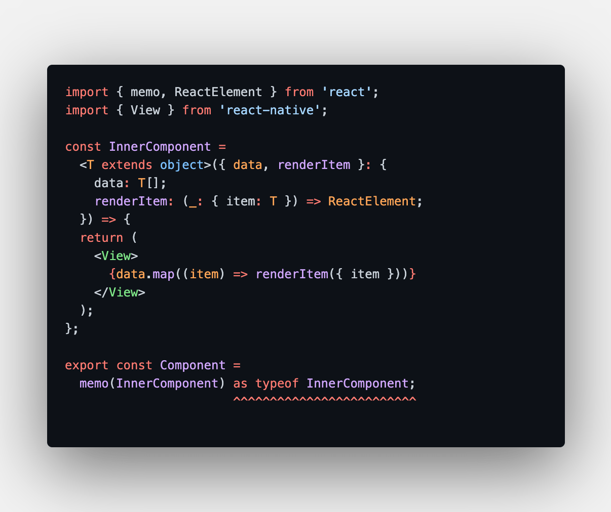
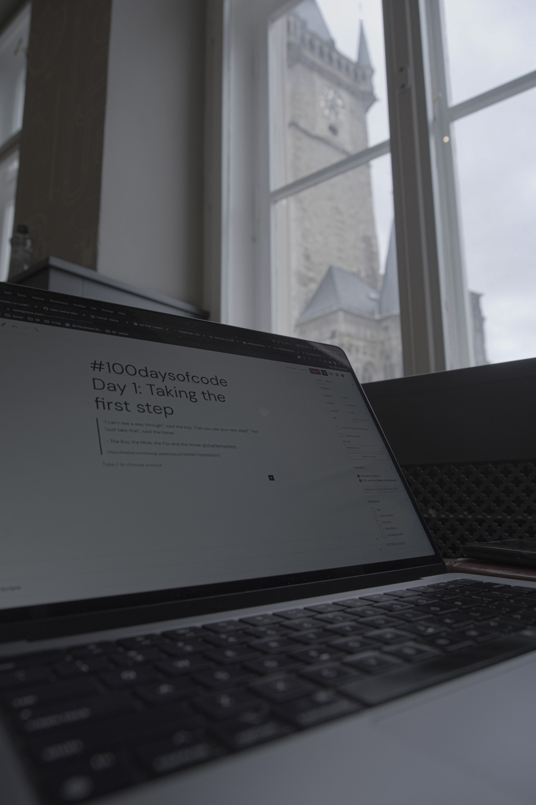

> “I can’t see a way through”, said the boy.
> “Can you see your next step?”
> “Yes”
> “Just take that,” said the horse.
> The Boy, the Mole, the Fox and the Horse

I have been going over this for long, and it is high time I do this. Rephrasing, It would be a waste of my time if I don’t do this!

## Background

I have been a developer for most of the last 13 years. I have built tools and libraries consumed primarily internally at my company, [Statusbrew](https://statusbrew.com/).

I used to be active in building [communities](/blog/tags/amritsar-startups/) of creators, developers, and startup/small business owners in my [home city](/blog/tags/amritsar/). I had many occasions to meet new people and share knowledge with them. We were also covered frequently by the local press. Many people in our city knew about us and were following our work.

After the pandemic started, I passed on the opportunity to become active in the social space as I focused on sales and revamping our web and mobile applications. It’s been nearly 2 years since I also gave up even on talking to my own customers and delved deeper into coding behind my work desk. That closed work focus was the need of the time, but now most of the hard work is done.

I have temporarily moved to Prague and have spent a significant chunk of the last 2 years here but working from home. I moved to a co-working space in November and saw my communication and social circle improve. I am inspired by the tech talks I get to attend nowadays, and I envision being part of the core community soon.

It was not easy getting back within groups of people and talking. Often I find myself in the situation I was in 12 years ago when I moved to Japan – my accent and the words I use are hard for people to understand. I am also stumbling during simple discussions. This is due to the lack of social interactions in the last years.

So things need to change. I needed push myself to become more active virtually and in daily dealings for my growth.

Thus, this challenge.

## Objective

I am taking up this challenge to work on the following aspects:

1. Knowledge sharing
2. Communication
3. Time management

### Knowledge sharing

Every day, I work on exciting solutions, designs, and architecture that goes into building a complex application. A portion of that knowledge gets shared with my team, but most of it gets lost as I move on to the next problem.

Occasionally, I get to attend tech meetups and discuss challenges with other developers. Most expressed excitement when they learn about some unique designs we have worked on our with our application architecture. I reciprocated similarly when I learned something new from them.

I started to take small steps of knowledge sharing and technical discussions in my current workspace. When I am stuck, I reach out to developers in the space; those discussions have benefitted me.

A simple example:

I could find a workaround for using Components with Generics and `memo` (or even `forwardRefs`) that helped enforce strict type definitions in my component designs. This solution was given by a fellow react developer in my coworking space.

### Communication

There is no doubt that writing and speaking skills are incredibly essential nowadays. We have infinite thoughts, though a majority of them are banal. But there are many ideas that, when shared, can lead to meaningful interactions and connections.

During all that hustle in the last 3 years, I hadn’t been reading, writing, or engaging in public communication. Recently, I had moments when it was hard to express myself and communicate well.

With this challenge, I will focus on articulating and publishing a daily post, however small it will be, on this blog under the #100daysofcode tag.

I will discuss javascript, typescript, mono repo, angular, react, and architecture designs. Currently, I do not plan to publish open-source libraries, but I would love to release something helpful to others whenever possible.

I will also use various tools and modes to share knowledge, an upcoming [github monorep](https://github.com/rishabhmhjn), [Expo Snacks](https://snack.expo.dev/) & [gists](https://gist.github.com/rishabhmhjn). I also plan to publish a mundane looking timelapse of one of my daily pomodoro sessions on the [@ramenhacker](https://instagram.com/ramenhacker) Instagram page.

### Time management

Without a doubt, my work at Statusbrew has and will likely continue to precede other initiatives. However, I want to push myself to pursue other interests, knowing that now it’s more possible to do so than ever before.

My tentative time divisions would be as follows:

1. Statusbrew (8 – 10 hours)
2. Publish a readable gist/snack/monorep (0.5 hour)
3. Timelapse reel (0.5 hour)
4. Daily progress report blog post (1 hour)

Undoubtedly, I won’t have the same bandwidth to strictly follow the above time allocation. I reckon it will be a tentative time division when looked at over the course of a week or month.

This blog has taken me about 4 hours to write! Of course, I don’t intend to write lengthy monologues every day. But I don’t want to take more than 20-30 minutes to write the next set of posts

## Goal

My ultimate goal with this challenge is to give a presentation about a topic I have mastered at a developer meetup.

To achieve this goal, I will

1. Learn to organize my thoughts into speaking bits and writing
2. Be more active in the nearby developer communities
3. Become comfortable in front of an audience or camera

## Next Steps

In the coming week, I will set up a high-level plan of action and milestones leading toward my goal.

Tomorrow, I will set up and publish a monorepo with my frequently used configs, such as .dotfiles, eslint, and prettier. Soon, I will be writing about Angular, React, Vite, Monorepo architecture, and the best practices we have implemented.

From Starbucks in front of the Astronomical Clock in Prague

This challenge will not solve all my communication problems. But it sure will help improve it a little bit. So I am taking the next step.

Have a great rest of the weekend. See you soon.
