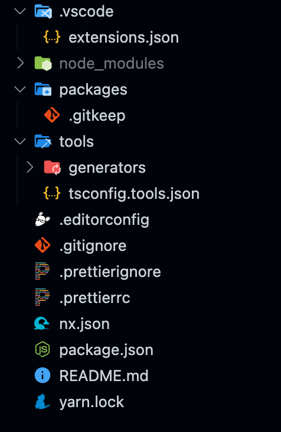
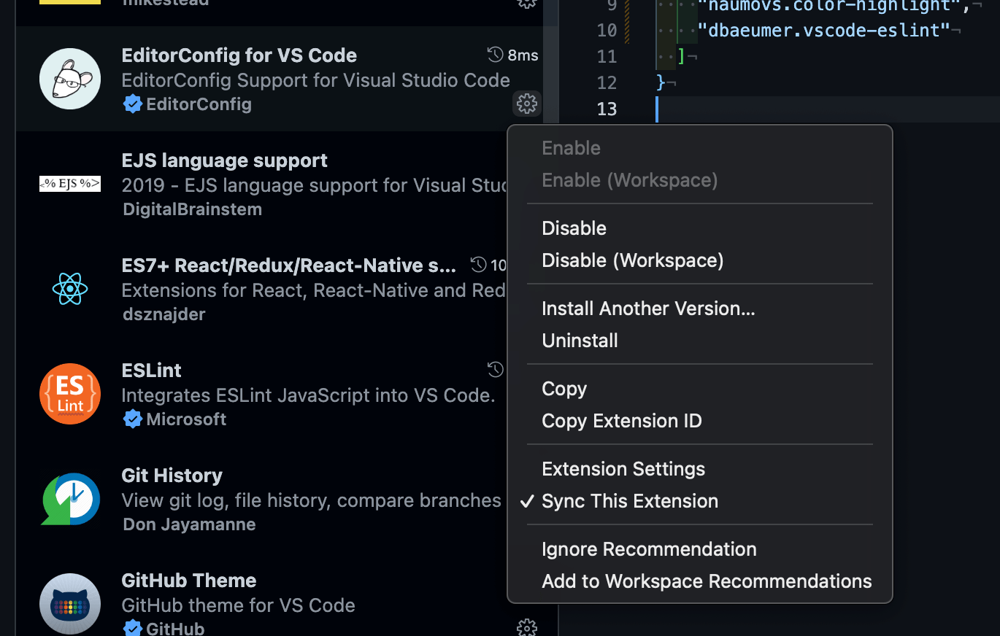
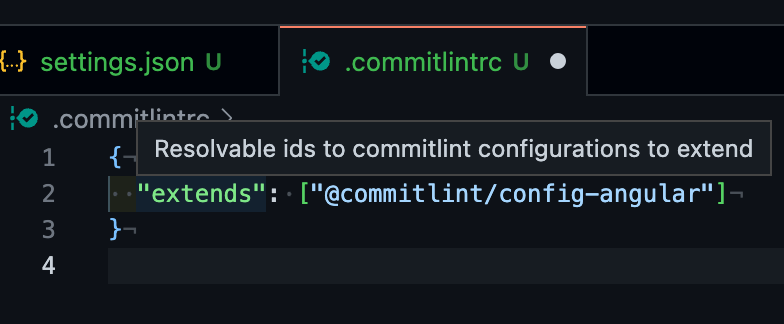

It’s 23:31 at the time of starting this blog! I just returned from a Toastmasters event.

I didn’t get time to work on the challenge today in the coworking space as I was busy with a few meetings and the goal of completing the skeleton of the data management flow of our Create post page with custom hooks. I am happy that it was finished before I left for the Toastmasters.

Tomorrow, I will complete the integration of data management hooks with the screens.

## Toastmasters

A fellow at the coworking space invited me to join him at the Toastmasters event. Toastmasters is an organization that encourages people to learn public speaking and communication skills through regular events, usually weekly.

It’s an incredible stroke of luck that I recently talked about improving my speaking skills, and today there I was as part of a community that’s doing just that. The participants were half Czech and half expat.

The topic of today was confusing: Reverse Toastmasters. It was about doing all the things they usually do, but in reverse.

It kicked off with an ending farewell note, feedback on the speeches (that were yet to come), and lastly the introduction of what the Toastmasters event is. It was confusing for all the participants! However, it was fun and interesting.

I am inclined towards joining one of these groups. I found the people to be kind and supportive. Everyone seemed to have come with a shared ambition of learning how to speak in public. That is just what I was looking for!

I still struggle to find the right words to communicate well. The easier, straightforward topics for me to talk about are differences in culture, work, and jokes.

But my goal is to give an informative presentation on a specific topic. It’s easy to do small talks about random topics with a handful of people, but it is challenging to keep a large audience engaged when you have all their attention and expectations to gain something out of the time they spend listening to you. It’s daunting!

> When you learn to write, you learn to think

One of the ways I feel I can overcome this hurdle is by writing. It’s very late now, but I want to write a blog daily; no excuse! So here we are.

For the challenge, today I will create and publish the 100daysofcode repository with support for `nx`, `commitlint` and `husky`. Let’s get started.

## Monorepo setup

### Nx

We will initialize our 100daysofcode challenge monorepo using the `create-nx-workspace` command. I will talk more about monorepo and their benefits in the coming days. For now, let’s create our repository.

```
$ npx create-nx-workspace@latest @rishabhmhjn/100daysofcode --preset=ts --package-manager=yarn
```

This should initialize your repository with the following files.



### Install recommended VS Code extensions

I suggest you also install the VSCode extension for NX, which will make it easier to run NX commands directly from the editor.


*The recommendation to install Nx console is already added to your .`vscode/extensions.json` file, so it should appear in your Extensions tab under the **Recommended** window.*

I will also add some of the extensions I use daily to my list of recommended extensions.

I could type in their IDs directly into the JSON file manually.

I can also search the extensions and press the **Add to Workspace Recommendations** file directly from the UI. The extension IDs are added to the `.vscode/extensions.json` file automatically.



This is how my `.vscode/extensions.json` file looks like

```
{
  "recommendations": [
    "nrwl.angular-console",
    "esbenp.prettier-vscode",
    "formulahendry.auto-rename-tag",
    "jannisx11.batch-rename-extension",
    "aaron-bond.better-comments",
    "wmaurer.change-case",
    "naumovs.color-highlight",
    "dbaeumer.vscode-eslint",
    "editorconfig.editorconfig",
    "oderwat.indent-rainbow",
    "ecmel.vscode-html-css",
    "eamodio.gitlens",
    "davidanson.vscode-markdownlint",
    "pnp.polacode",
    "medo64.render-crlf",
    "ms-vscode.sublime-keybindings",
    "angular.ng-template"
  ]
}
```

### Prettier

Now we can start adding our custom configs, starting with `prettier`. I use the following config for our projects.

```
{
  "singleQuote": true,
  "useTabs": false,
  "tabWidth": 2,
  "semi": true,
  "trailingComma": "none",
  "bracketSpacing": true,
  "htmlWhitespaceSensitivity": "strict",
  "printWidth": 80,
  "overrides": [
    {
      "files": ["**/*.html"],
      "options": {
        "printWidth": 120
      }
    },
    {
      "files": "*.{yaml,yml}",
      "options": {
        "singleQuote": false
      }
    }
  ]
}
```

### Commitlint

Commitlint helps you create consistent commit messages. You can follow the instructions at [https://github.com/conventional-changelog/commitlint](https://github.com/conventional-changelog/commitlint).

```
# Install commitlint cli and conventional config
$ yarn add @commitlint/{config-conventional,cli} -D
```

I tend to follow [Angular’s commit message guidelines.](https://github.com/angular/angular/blob/main/CONTRIBUTING.md#-commit-message-format) We can install the [package](https://www.npmjs.com/package/@commitlint/config-angular) containing their commitlint rules.

```
# Install the angular commit lint config
$ yarn add @commitlint/config-angular -D
```

Now, although `commitlint` manual suggests using a `commitlint.config.js` file, I will go a different route and use a `.commitlintrc` file.

```
echo '{"extends": ["@commitlint/config-angular"]}' > .commitlintrc
```

I will also instruct the VSCode editor to fetch the schema of the JSON file so that I can get a neat explanation of what the various property means. To do that, I will add a new file `.vscode/settings.json`.

```
// .vscode/settings.json
{
  "json.schemas": [
    {
      "fileMatch": [".commitlintrc.json", ".commitlintrc"],
      "url": "https://json.schemastore.org/commitlintrc.json"
    }
  ]
}
```

Once the schema is fetched, you can hover on to the properties and also get code completions:



### Husky

We also need to add `husky` that automatically runs the pre-commit hooks for `commitlint` and the `eslint` later.

```
# Install Husky v6
yarn add husky --dev

# Activate hooks
yarn husky install

# Add the pre-commit hook
npx husky add .husky/commit-msg  'npx --no -- commitlint --edit ${1}'
```

This should add a few files to the `.husky` folder.

To ensure the git hooks are installed automatically if you move systems or when someone else works on your repository, you need to add the following command to your scripts in package.json

```
  "scripts": {
    "prepare": "husky install"
  },
```

Before committing the above changes, we should add our own `commitlint` config. I foresee using the following config for the coming time, so I will add it manually. This is what my `.commitlintrc` will look like.

```
{
  "extends": ["@commitlint/config-angular"],
  "helpUrl": "https://commitlint.js.org/#/reference-rules",
  "rules": {
    "type-enum": [
      2,
      "always",
      ["build", "docs", "feat", "fix", "perf", "refactor", "revert"]
    ],

    "scope-max-length": [2, "always", 16],
    "scope-min-length": [2, "always", 2],
    "scope-empty": [2, "never"],
    "scope-enum": [2, "always", ["infra"]],

    "subject-case": [2, "always", ["sentence-case", "lower-case"]],

    "header-max-length": [2, "always", 72],
    "body-max-line-length": [2, "always", 72]
  }
}
```

I will add more `scope-enum` in the coming days of the challenge. You can read more about the `commitlint` rules [here](https://commitlint.js.org/#/reference-rules).

Now, if you would try to commit with a non-conforming commit message, you will get an error, and the commit will fail.

```
# 1. Without any format
$ git commit -m "Any Commit"                                                                                                       

⧗   input: Any Commit
✖   subject may not be empty [subject-empty]
✖   type may not be empty [type-empty]
✖   scope may not be empty [scope-empty]

✖   found 3 problems, 0 warnings
ⓘ   Get help: https://commitlint.js.org/#/reference-rules

husky - commit-msg hook exited with code 1 (error)

# 2. Following the format but exceeding max header length
$ git commit -m "feat(infra): Adding .prettierrc, .commitlintrc and recommended vscode extensions"
⧗   input: feat(infra): Adding .prettierrc, .commitlintrc and recommended vscode extensions
✖   header must not be longer than 72 characters, current length is 80 [header-max-length]

✖   found 1 problems, 0 warnings
ⓘ   Get help: https://commitlint.js.org/#/reference-rules

husky - commit-msg hook exited with code 1 (error)
```

This means that our pre-commit hook with commitlint is working. We can now commit the current code with a proper message.

```
$ git commit -m "feat(infra): Adding .prettierrc, .commitlintrc and .vscode/extensions"

[main febffba] feat(infra): Adding .prettierrc, .commitlintrc and .vscode/extensions
 7 files changed, 1010 insertions(+), 18 deletions(-)
 create mode 100644 .commitlintrc
 create mode 100755 .husky/commit-msg
 rewrite .prettierrc (84%)
 create mode 100644 .vscode/settings.json
```

Success! Now I will push this newly created repository to my github profile.

[https://github.com/rishabhmhjn/100daysofcode](https://github.com/rishabhmhjn/100daysofcode)

It’s 01:33 now! I planned to do more, but I need to sleep to be able to finish my ComposePage tomorrow.

Tomorrow, for the challenge, I plan to work on the following within the new nx monorepo:

1. Create a simple Angular/React/Vite project
2. Create & test custom eslint-plugin
3. Update the Readme.md

It was a very crude post today, but I hope it will be useful to you.

See you tomorrow.
