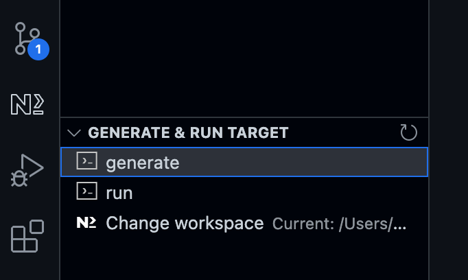
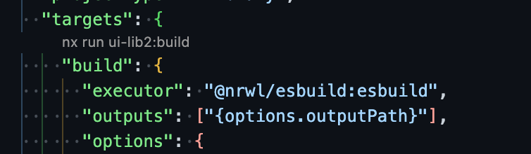
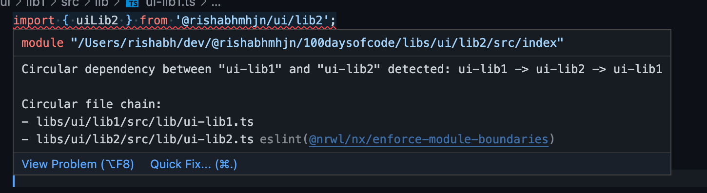

Today’s challenge will be a quick one.

I would create and use a custom eslint-plugin in our upcoming libraries & projects. Our goal with the eslint-plugin library will be to share reusable eslint configurations.

Before we generate any new library, I want to change the configuration of nx to add new libraries to the `/libs` folder and new projects to the `/projects` folder. Update the `nx.json` file to reflect the following:

```
{
  .
  "workspaceLayout": {
    "appsDir": "projects",
    "libsDir": "libs"
  }
  . 
}
```

Next, we will generate 2 ui libraries by running the following commands.

```
$ nx generate @nrwl/js:library lib1 --unitTestRunner=none --bundler=esbuild --directory=ui --no-interactive
$ nx generate @nrwl/js:library lib2 --unitTestRunner=none --bundler=esbuild --directory=ui --no-interactive
```

Alternatively, we can generate the new libraries using the nx-console extension gui.



Let’s learn about some of the newly generated library files.

#### `tsconfig.base.json`

This will be the root Typescript configuration for our project. All future libraries or projects will be extending this configuration.
The important section to note is `paths` where we can see our newly added library mentioned.

```
{
...
    "paths": {
      "@rishabhmhjn/ui/lib1": ["libs/ui/lib1/src/index.ts"],
      "@rishabhmhjn/ui/lib2": ["libs/ui/lib2/src/index.ts"]
    }
...
}
```

#### libs/ui/lib{1,2}

##### project.json

This critical file contains the configurations and commands we would like to run via our nx console.

If you have installed the nx-console extension, you will see small links to run the commands (or targets) directly from the project.json file.



We can go ahead and run the build command directly from the project.json file or type the following command in the console.

```
$ nx run ui-lib2:build
```

The library will be compiled to the `/dist` folder.

### `Eslint`

There will be 3 files related to eslint that are added to our repository.

```
/.eslintrc.json
/.eslintignore
/libs/ui-lib{1,2}/.eslintrc.json
```

There are 2 essential things to note about the root `.eslintrc.json`.

1. nx’ eslint-rule:
  @nrwl/nx/enforce-module-boundaries
  This handy rule triggers warnings if we have circular dependencies in our libraries or projects. You can read more about the rule
  here
2. By default, the whole repository is marked as ignored with
  "ignorePatterns": ["**/*"]
  . Every individual library or project does the opposite and marks themselves as not ignored in their respective
  .eslintrc.json
  configurations

Besides `ignorePatterns` in the `.eslintrc.json` file, we also see a `.eslintignore` file that contains more file patterns to be ignored globally.

Now, we will quickly test the `@nrwl/nx/enforce-module-boundaries` rule by updating the following 2 files:

`/libs/ui/lib1/src/lib/ui-lib1.ts`

```
import { uiLib2 } from '@rishabhmhjn/ui/lib2';

export function uiLib1(): string {
  return 'ui-lib1';
}

export function testBoundaries() {
  return uiLib2();
}
```

`/libs/ui/lib2/src/lib/ui-lib2.ts`

```
import { uiLib1 } from '@rishabhmhjn/ui/lib1';

export function uiLib2(): string {
  return 'ui-lib2';
}

export function testBoundaries() {
  return uiLib1();
}
```

We can see that the eslint extension will be showing an error:



This means our eslint setup is working!

We can also see that the warning goes off if we deactivate the rule in the root .eslintrc.json config

```
        {
        "@nrwl/nx/enforce-module-boundaries": [
          "off",
          {...}
        }
```

Now we can create our shared eslint-plugin library where will move the `@nrwl/nx/enforce-module-boundaries`.

Let’s create a new library: `@rishabhmhjn/eslint-config`.

```
$ nx generate @nrwl/js:library eslint-plugin \
  --unitTestRunner=none \
  --bundler=esbuild \
  --directory=etc \
  --importPath=@rishabhmhjn/eslint-plugin \
  --js \
  --no-interactive
```

It is essential to know that eslint-plugin can only use configs exposed from other npm packages and not via the typescript’s `paths` configuration.

Since we will add our newly added library as a `link`ed package directly into our root package.json, we can choose to remove the path entry from the `tsconfig.base.json` file.

```
// tsconfig.base.json
{
 "paths": {
      "@rishabhmhjn/eslint-plugin": ["libs/etc/eslint-plugin/src/index.ts"], // You may remove this line
      "@rishabhmhjn/ui/lib1": ["libs/ui/lib1/src/index.ts"],
      "@rishabhmhjn/ui/lib2": ["libs/ui/lib2/src/index.ts"]
    }
}
```

##### `package.json`

Our package name is already set to what we need, so we do not require any change here.

```
{
  "name": "@rishabhmhjn/eslint-plugin",
  "version": "0.0.1",
  "type": "commonjs"
}
```

We will add the new library as a yarn-linked package with the following command.

```
$ yarn add link:./libs/etc/eslint-plugin -D
```

This will create a new entry `"@rishabhmhjn/eslint-plugin": "link:./libs/etc/eslint-plugin"` in the `devDependencies` of the root package.json file.

Now let’s make the following changes to our repository:

- Update
  libs/etc/eslint-plugin/package.json
  This exposes our main
  index.js
  file that will export our shared eslint configs.

```
{
  "name": "@rishabhmhjn/eslint-plugin",
  "version": "0.0.1",
  "type": "commonjs",
  "main": "src/index.js" // Add this line
}
```

- Remove
  libs/etc/eslint-plugin/src/lib/etc-eslint-plugin.js
  We don’t need this file

- Add
  libs/etc/eslint-plugin/src/lib/configs/nx.js
  This is the config containing the set of rules bunched together. We can see that this is the javascript equivalent of the rule in the current root
  .eslintrc.json
  file.

```
module.exports = {
  plugins: ['@nrwl/nx'],
  overrides: [
    {
      files: ['*.ts', '*.tsx', '*.js', '*.jsx'],
      rules: {
        '@nrwl/nx/enforce-module-boundaries': [
          'error',
          {
            enforceBuildableLibDependency: true,
            allow: [],
            depConstraints: [
              {
                sourceTag: '*',
                onlyDependOnLibsWithTags: ['*']
              }
            ]
          }
        ]
      }
    }
  ]
};
```

- Update
  libs/etc/eslint-plugin/src/index.js
  This is how we name and export the configs. Currently, we are exporting the
  nx
  config as
  plugin:@rishabhmhjn/eslint-plugin/nx
  or short
  plugin:@rishabhmhjn/nx

```
module.exports = {
  configs: {
    nx: require('./lib/configs/nx')
  }
};
```

Once these changes are made, we can remove the rule from the root config and extend the config we just exposed with our new eslint-plugin library.

- Update
  .eslintrc.json

```
{
  "root": true,
  "ignorePatterns": ["**/*"],
  "plugins": ["@nrwl/nx"],
  "extends": ["plugin:@rishabhmhjn/eslint-plugin/nx"],
  "overrides": [
    {
      "files": ["*.ts", "*.tsx", "*.js", "*.jsx"],
      "rules": {}
    },
    {
      "files": ["*.ts", "*.tsx"],
      "extends": ["plugin:@nrwl/nx/typescript"],
      "rules": {}
    },
    {
      "files": ["*.js", "*.jsx"],
      "extends": ["plugin:@nrwl/nx/javascript"],
      "rules": {}
    }
  ]
}
```

Now we can go back to the `libs/ui/lib1/src/lib/ui-lib{1,2}.ts` files and still see that the same lint error.

Except for this time, the rule triggering this error comes from our new eslint-plugin library, not the rule inside the root `.eslintrc.json`.

Hope you found this helpful. This was a very crude introduction to setting up an eslint plugin, but we will explore this further tomorrow along with

1. Setting up an angular web app project
2. Add a few eslint configs and implement them differently across libs
3. Add lint-staged config with a husky pre-commit hook

See you again tomorrow.
