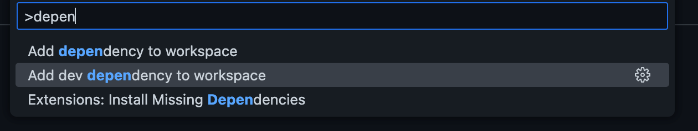
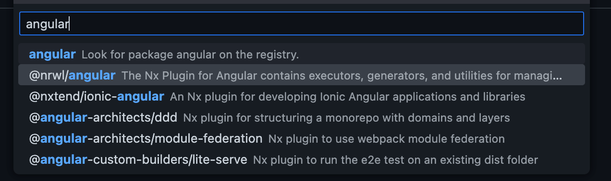
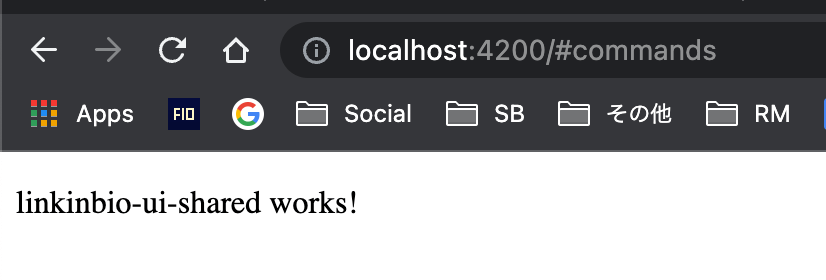

I had to take a break! I was working from early in the morning and was finishing Statusbrew tasks until late at night before I could get back home to figure out what to write about the blog and then code/screenshot/document and write about it.

I was up until 2 am consistently for the whole week. I was drained a lot on Wednesday, thinking I would write the blog upon waking up, and, predictably, that didn’t happen.

I would only delay this process for a while, but it won’t be canceled. I want to write daily. I want to build up this habit and do this consistently. A cliché but giving up isn’t an option.

I have to mention that writing regularly is one of the things I want to do, me prioritizing Statusbrew tasks, which is for sure would be my priority, is another way to ensure I get done with the complicated Statusbrew tasks so that I can come back to writing as quickly as possible with a more bandwidth.

Another goal of mine is to return to Sales and Marketing by the end of this month. Looking at the current pace of tasks, it seems unlikely I would be done by the end of the month, but the deviation would probably be for about a week. This doesn’t mean that the Statusbrew tasks will entirely disappear. It just means that I would focus on mentoring & quality control in development while spending significantly more time on Sales.

Getting back to the challenge now. Day 4 it is.

Today, I want to set up an Angular application inside our nx monorepo.

My goal in the next few days is to learn the following concepts/frameworks and combine them to build the application:

1. SSR – Server-Side Rendering (
  Angular
  )
2. PWA – Progressive Web Application (
  Angular
  )
3. NestJS
4. Storybook
  (with
  Compodoc
  )
5. Testing (
  Angular
  &
  NestJS
  )
6. Railway

While considering the type of application to cover the above, apart from the de-facto todos app, I want to build something that can align with what we can use at Statusbrew. There is one app idea I think may require integration across all the above – Link In Bio.

It has been asked by a few of our clients already. Quite simply, some brands like to share a page on their bio containing some of the most common links to their brand web pages, social profiles, news articles, and dynamic content, such as links to the latest blog posts, giveaways, etc.

There are some great apps already out there. e.g. [https://lnk.bio/](https://lnk.bio/) is simple yet filled with compelling features like sync with the latest YouTube videos, and stats.

I plan to eventually have similar features more aligned with our clients’ preferences. Thinking about it in detail feels like a year-long project, but we would start with the basics here and add more features as we move along.

Today, we will bootstrap 2 angular entities, a library, and an app, and use the incremental build feature to build both.

We will start by installing [nx angular](https://nx.dev/packages/angular) dependency on our project. I initially tried using the console with the following commands but it seems the workflow to initialize the app afterward is not well laid out.

```
$ yarn add -D @nrwl/angular @angular-devkit/core @angular-devkit/schematics
```

I had to use the NX Console extension to add the dependency properly. You can find more information [here](https://nx.dev/recipes/nx-console/console-add-dependency-command).

Let’s just go ahead and add the nx angular depenency to our project.





Let it go through the process and modify the repository. You will see changes to package.json, `nx.json`, `.gitignore`, and `.vscode/extenstions.json`. You will also find some jest.* files added.

Here are the commands that it seems to have run in the process

```
$ yarn add -D -W  @nrwl/angular
$ yarn nx g @nrwl/angular:init  --interactive=false
```

We will make some changes to the nx.json file related to generator configs that would look like this

```
{
  "generators": {
    "@nrwl/angular:application": {
      "style": "scss",
      "linter": "eslint",
      "unitTestRunner": "jest",
      "e2eTestRunner": "cypress",
      "strict": true,
      "prefix": "rm",
      "standalone": true
    },
    "@nrwl/angular:library": {
      "linter": "eslint",
      "unitTestRunner": "jest",
      "strict": true,
      "prefix": "rm",
      "style": "scss",
      "changeDetection": "OnPush",
      "standalone": true
    },
    "@nrwl/angular:component": {
      "style": "scss",
      "prefix": "rm",
      "changeDetection": "OnPush",
      "standalone": true
    }
  }
}
```

Now, we will generate a ui library for `linkinbio`. I would be using the UI to create the lib, which would use the following command.

```
$ yarn nx generate @nrwl/angular:library shared \
  --buildable \
  --directory=linkinbio/ui \
  --no-interactive
```

Our new library is now available at `/libs/linkinbio/ui/shared`.

You can now quickly build the library using the nx-console, project.json or with the following command

```
$ nx build linkinbio-ui-shared
```

Now, let’s quickly create a new application. Again, I will use nx-console to initialize the app, which eventually uses the following command.

```
$ nx generate @nrwl/angular:application linkinbio
```

I learned that we must manually add the missing `@angular-eslint/eslint-plugin` since it is not added after scaffolding. Let’s add that package too.

```
$ yarn add -D @angular-eslint/eslint-plugin
```

Now, we can launch the newly created app

```
$ nx serve linkinbio
```

Let’s make the following changes to the app

1. Add
  imports: [LinkinbioUiSharedComponent]
  to
  app.component.ts
2. Update the content of
  app.component.html
  to just [
  ]
3. Remove
  nx-welcome.component.ts

You can see our app successfully imported a component from a library project.



Let us build the app to ensure proper library imports as well as incremental builds.

```
$ nx build linkinbio
                                                                                     
   ✔    1/1 dependent project tasks succeeded [0 read from cache]

   Hint: you can run the command with --verbose to see the full dependent project outputs

 ———————————————————————————————————————————————————————————————————————————————————————————————————————————————————

> nx run linkinbio:build:production

✔ Browser application bundle generation complete.
✔ Copying assets complete.
✔ Index html generation complete.

Initial Chunk Files           | Names         |  Raw Size | Estimated Transfer Size
main.068e18dfd9616db8.js      | main          |  82.28 kB |                25.05 kB
polyfills.a0e551d9f0aaa365.js | polyfills     |  33.09 kB |                10.65 kB
runtime.dfd26405657e5395.js   | runtime       | 896 bytes |               509 bytes
styles.ef46db3751d8e999.css   | styles        |   0 bytes |                       -

                              | Initial Total | 116.24 kB |                36.19 kB

Build at: 2023-03-13T00:27:27.824Z - Hash: 0e4718ad16d04a5c - Time: 5027ms

 ———————————————————————————————————————————————————————————————————————————————————————————————————————————————————

 >  NX   Successfully ran target build for project linkinbio and 1 task it depends on (8s)
```

You will see that the initial instructions are to build the library before building the app. In the end, the app builds successfully

This will be it for tonight. We will work with Angular Material and Storybook tomorrow to create UI components.

See you tomorrow.
