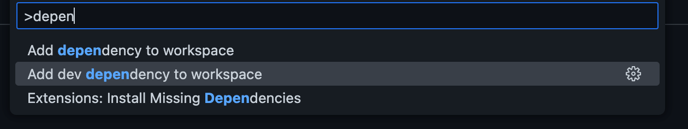
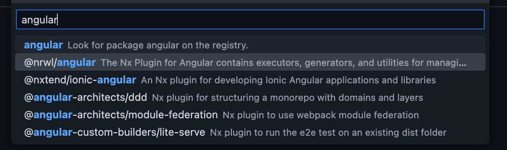
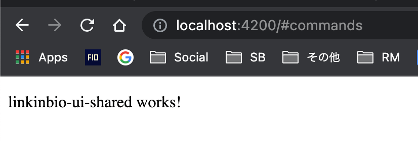

I had to take a break.

I was working on Statusbrew tasks from early in the morning until late at night. By the time I got home, I still had to choose a topic, write the code, take screenshots, document the result, and turn it all into a post.

I stayed up until 2 am through most of the week. By Wednesday I was drained. I thought I would write after waking up, but, predictably, that didn't happen.

The challenge was delayed, not cancelled. Statusbrew work is still the priority, and finishing the complicated tasks there should give me more room to return to writing consistently.

I also want to return to Sales and Marketing by the end of the month. At the current pace, I will probably miss that by about a week. Development work won't disappear, but I want more of my time there to move toward mentoring and quality control.

Back to the challenge. Day 4 it is.

Today I want to set up an Angular application inside the Nx workspace and prove that it can import and build a component from a library.

Over the next few days, I want to combine:

1. Angular server-side rendering
2. Angular as a progressive web application
3. NestJS
4. Storybook with Compodoc
5. Angular and NestJS testing
6. Railway

I didn't want to build another todo application. I wanted something that could eventually be useful at Statusbrew, and a Link in Bio application seemed to touch all of these areas.

Some of our clients had already asked for it. Brands often need one page in their bio that points to their website, social profiles, news, recent blog posts, giveaways, and other changing content.

[lnk.bio](https://lnk.bio/) is a good example. It stays simple while adding useful features such as syncing recent YouTube videos and showing statistics.

Building everything I can imagine for this product could take a year. For now, I am starting with the basics and will add features as the project moves forward.

Today's work is smaller: bootstrap an Angular library and application, connect them, and use Nx to build both.

## Adding Angular to the workspace

I started by adding the [Nx Angular](https://nx.dev/packages/angular) dependency. My first attempt used these packages directly:

```
$ yarn add -D @nrwl/angular @angular-devkit/core @angular-devkit/schematics
```

The initialization flow afterward wasn't clear, so I used the Nx Console extension to add the dependency properly. The [Nx Console documentation](https://nx.dev/recipes/nx-console/console-add-dependency-command) explains that command.





The process updated `package.json`, `nx.json`, `.gitignore`, and `.vscode/extensions.json`, and added the Jest configuration files. Underneath the UI, it appeared to run:

```
$ yarn add -D -W @nrwl/angular
$ yarn nx g @nrwl/angular:init  --interactive=false
```

I then added generator defaults to `nx.json`:

```
{
  "generators": {
    "@nrwl/angular:application": {
      "style": "scss",
      "linter": "eslint",
      "unitTestRunner": "jest",
      "e2eTestRunner": "cypress",
      "strict": true,
      "prefix": "rm",
      "standalone": true
    },
    "@nrwl/angular:library": {
      "linter": "eslint",
      "unitTestRunner": "jest",
      "strict": true,
      "prefix": "rm",
      "style": "scss",
      "changeDetection": "OnPush",
      "standalone": true
    },
    "@nrwl/angular:component": {
      "style": "scss",
      "prefix": "rm",
      "changeDetection": "OnPush",
      "standalone": true
    }
  }
}
```

## Creating the library and application

I used Nx Console to generate a buildable UI library for `linkinbio`. It produced the equivalent of:

```
$ yarn nx generate @nrwl/angular:library shared \
  --buildable \
  --directory=linkinbio/ui \
  --no-interactive
```

The new library was available at `/libs/linkinbio/ui/shared`, and I could build it with:

```
$ nx build linkinbio-ui-shared
```

I used Nx Console again to initialize the application:

```
$ nx generate @nrwl/angular:application linkinbio
```

The scaffold did not add `@angular-eslint/eslint-plugin`, so I installed it manually:

```
$ yarn add -D @angular-eslint/eslint-plugin
```

The application was ready to serve:

```
$ nx serve linkinbio
```

I made three changes:

1. Added `imports: [LinkinbioUiSharedComponent]` to `app.component.ts`.
2. Replaced the generated content in `app.component.html`.
3. Removed `nx-welcome.component.ts`.

The application was now importing a component from the library:



The final check was the application build:

```
$ nx build linkinbio

✔ 1/1 dependent project tasks succeeded
✔ Successfully ran target build for project linkinbio and its dependency
```

Nx built the library first and then the application. That was the result I wanted today: the app could import the shared component, and the complete dependency chain built successfully.

That is it for tonight. Tomorrow I will use Angular Material and Storybook to start creating the UI components.

See you tomorrow.
