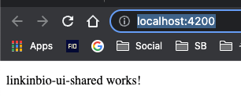
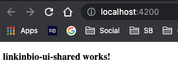
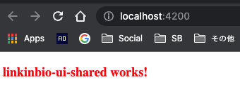

With another missed day in my challenge, I will work on packaging styles with a library and use them in our newly created Angular app.

## Angular app styles

It is easier to serve or build styles inside your app with the default configurations. Once you scaffold an application, the styles are available at `{projectRoot}/src/styles.scss`.

To test it out, let us serve our application.

```
$ nx serve linkinbio
```

Now, open [http://localhost:4200/](http://localhost:4200/) and you can see your app component.



If we make a small change to our styles, we can see that in real-time in our app.

```
/* styles.scss */

/* You can add global styles to this file, and also import other style files */
p {
  font-weight: bold;
}
```



Great. So our styling works.

## The problem

This is good for a self-contained application.

However, in the case of large applications, there will be a requirement for sharing styles across your libraries and including them as part of the main application build process.

Creating a shared UI library containing variables, mixins, and shared component-specific styles is helpful.

So we will learn how to include styles from an NX library into our application.

## Solution – sharing styles across NX libraries

### Create styles

Let’s create some styles in our ui-shared library at `libs/linkinbio/ui/shared/src/styles/linkinbio-ui-shared`

```
/* libs/linkinbio/ui/shared/src/styles/linkinbio-ui-shared/_variables.scss */

$color-red: red;
```

```
/* libs/linkinbio/ui/shared/src/styles/linkinbio-ui-shared/theme.scss */

p {
  font-weight: bold;
}
```

### Update app/project.json

Now, let’s add the instructions to tell angular compiler to set `libs/linkinbio/ui/shared/src/styles` as one of the paths to look for for our new styles.

To do that, we will add the following `stylePreprocessorOptions` property to `projects/linkinbio/project.json` file.

```
{
        ...
        "styles": ["projects/linkinbio/src/styles.scss"],
        "stylePreprocessorOptions": {
          "includePaths": ["libs/linkinbio/ui/shared/src/styles"]
        },
        "scripts": []
        ...
}
```

### Import library styles

Now, you can easily import the styles into your app:

```
/* styles.scss */

/* You can add global styles to this file, and also import other style files */

@use 'linkinbio-ui-shared/variables' as ui-shared-variables;

@import 'linkinbio-ui-shared/theme';
// @import '@rishabhmhjn/linkinbio/ui/shared/linkinbio-ui-shared';

p {
  font-weight: bold;
  color: ui-shared-variables.$color-red;
}
```

You can see your styles applied in the browser.



It is important to note that I have added a distinct folder, `linkinbio-ui-shared`, inside the library styles folder. This is because, in the future, it is likely I will need to import styles from other libraries too.

To ensure the names of the shared styles do not collide with one another, I have chosen to namespace them by putting them in their own unique project name.

That’s it! Happy coding 🙂
