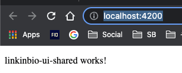
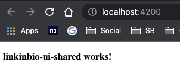
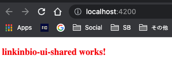

Another missed day.

Today I am working on packaging styles inside a library and using them in the Angular app we created yesterday. The immediate change is small, but I want the structure to keep working when more libraries need to share variables, mixins, and component styles.

## Angular app styles

An Angular application can serve its own styles with the default configuration. Once I scaffolded the application, its global styles were available at `{projectRoot}/src/styles.scss`.

I started by serving the application:

```
$ nx serve linkinbio
```

The app component was available at [http://localhost:4200/](http://localhost:4200/).



I made a small change in `styles.scss` to confirm that the app picked it up in real time:

```
/* styles.scss */

/* You can add global styles to this file, and also import other style files */
p {
  font-weight: bold;
}
```



Good. The application styles were working.

## The problem

That setup is fine for a self-contained application. It becomes less useful once several libraries need the same variables, mixins, or component styles.

I wanted those shared styles to live in the UI library and still be included in the main application build. That keeps the reusable UI decisions beside the reusable components instead of copying them into every application.

## Sharing styles from the Nx library

### Create styles

I created the shared styles under `libs/linkinbio/ui/shared/src/styles/linkinbio-ui-shared`.

```
/* libs/linkinbio/ui/shared/src/styles/linkinbio-ui-shared/_variables.scss */

$color-red: red;
```

```
/* libs/linkinbio/ui/shared/src/styles/linkinbio-ui-shared/theme.scss */

p {
  font-weight: bold;
}
```

### Update the application configuration

Next, I added `libs/linkinbio/ui/shared/src/styles` to the Angular compiler's lookup paths through `stylePreprocessorOptions` in `projects/linkinbio/project.json`.

```
{
        ...
        "styles": ["projects/linkinbio/src/styles.scss"],
        "stylePreprocessorOptions": {
          "includePaths": ["libs/linkinbio/ui/shared/src/styles"]
        },
        "scripts": []
        ...
}
```

### Import library styles

With that path configured, I could import the library styles from the application's `styles.scss`:

```
/* styles.scss */

/* You can add global styles to this file, and also import other style files */

@use 'linkinbio-ui-shared/variables' as ui-shared-variables;

@import 'linkinbio-ui-shared/theme';
// @import '@rishabhmhjn/linkinbio/ui/shared/linkinbio-ui-shared';

p {
  font-weight: bold;
  color: ui-shared-variables.$color-red;
}
```

The styles were now applied in the browser:



I deliberately added a `linkinbio-ui-shared` folder inside the library's styles folder. I will probably need to import styles from other libraries later, and generic filenames such as `_variables.scss` would otherwise collide.

Using the project name as a namespace keeps those imports predictable.

For now, the shared styles live with the library, the application can import them, and another library can follow the same structure without taking over the same names.
