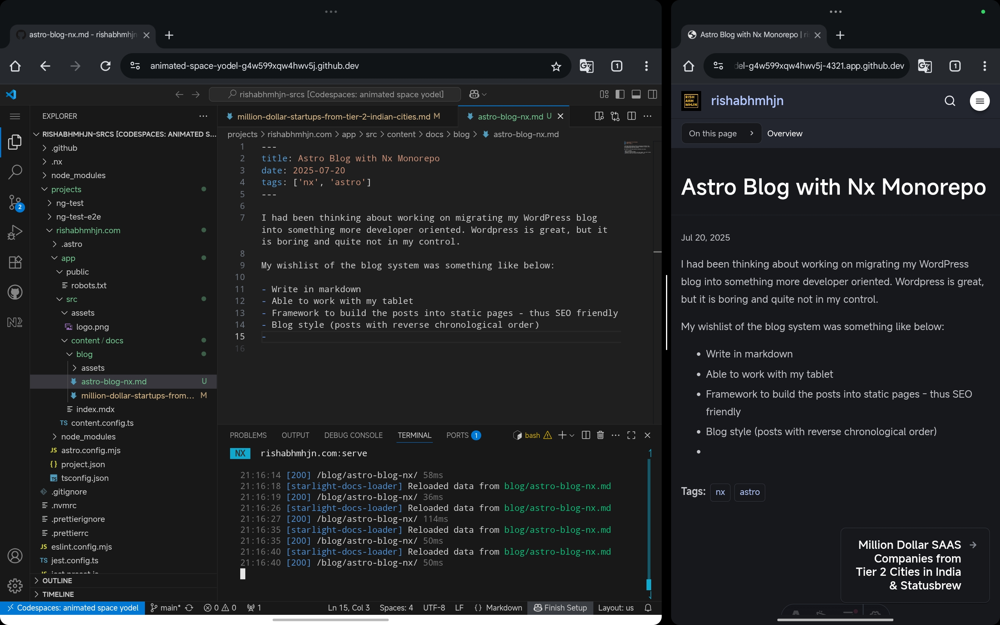

I had been thinking about migrating my WordPress blog into something more developer-oriented. WordPress is great — battle-tested, popular, and has a plugin for everything — but it’s not built for people like me who want full control over their content and workflow.

## ✅ My Wishlist

What I really wanted was a blog system that would let me:

- ✍️ Write posts in Markdown
- 🧳 Work comfortably from my tablet (via GitHub Mobile or Codespaces)
- ⚙️ Build into static pages (fast + SEO-friendly)
- 📚 Display posts in reverse chronological order like a traditional blog
- 🚀 Deploy via CI (GitHub Actions) and host on GitHub Pages or similar tooling

---

## 🚧 Enter Astro + Starlight

After evaluating a few static site generators, I chose [**Astro**](https://astro.build/), using the [**Starlight Rapide theme**](https://github.com/HiDeoo/starlight-theme-rapide). The reasons were simple:

- Fast static builds
- Clean, minimal layout
- Native Markdown support
- Easy to host and maintain
- Content collections for typed Markdown posts

---

## 🧱 Keeping It Inside a Monorepo

I already had an Nx workspace (`rishabhmhjn-srcs`) where I plan to keep all my projects. I added the Astro blog as an app inside `apps/rishabhmhjn.com`.

Each blog post lives under `src/content/blog/`, with frontmatter like:

```md
---
title: "My First Post"
pubDate: 2025-07-15
description: "This is the first post on my new Astro blog!"
tags: ["astro", "starter"]
---

```

This setup makes it super easy to write and commit from anywhere — even on mobile.

## 🚀 CI/CD with GitHub Actions + Pages

I created a GitHub Actions workflow that builds the Astro site and deploys to GitHub Pages. The steps are simple:

1. Install dependencies
2. Run astro build (wrapped in Nx)
3. Deploy `dist/projects/rishabhmhjn.com` using `peaceiris/actions-gh-pages`

More at `.github/workflows/rishabhmhjn.com.yml`


I verified my custom subdomain on GitHub by:

- Adding a TXT record (_github-challenge-<username>)
- Setting up a CNAME DNS record pointing astro.rishabhmhjn.com to rishabhmhjn.github.io


It now lives at <https://astro.rishabhmhjn.com> 🚀


## ✍🏼 Actual part of writing

I wanted to be able to perform some level of coding on my tablet and explore tools like codespaces. I am actually writing this blog on my tablet!



