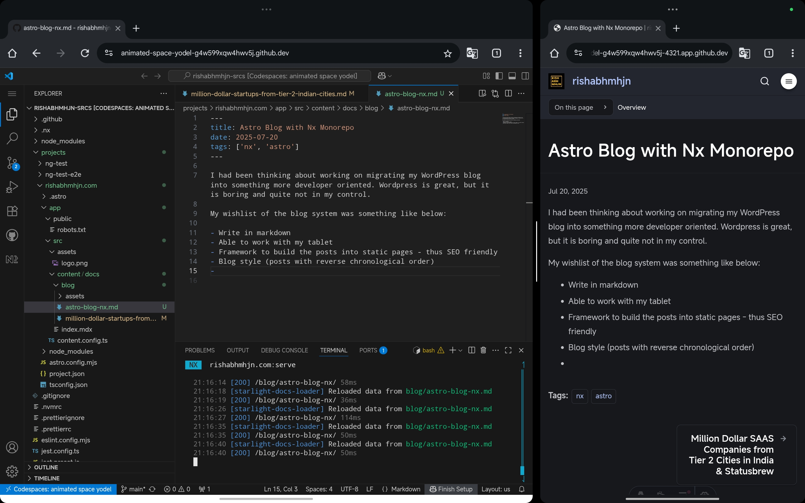

I am writing this blog on my tablet!

That was one of the main reasons I wanted to move away from WordPress. It is battle-tested, popular, and has a plugin for almost everything, but I wanted more control over how I write, store, and publish my posts.

The workflow I had in mind was straightforward:

- write posts in Markdown
- work from my tablet through GitHub Mobile or Codespaces
- build the site into static pages
- show posts in reverse chronological order
- deploy through GitHub Actions

I also wanted the blog to live beside my other projects instead of becoming another system to maintain.

## Choosing Astro and Starlight

After looking at a few static site generators, I chose [Astro](https://astro.build/) with the [Starlight Rapide theme](https://github.com/HiDeoo/starlight-theme-rapide).

Astro gave me static builds and native Markdown support. Starlight gave me a clean layout without having to build the reading experience first. Content collections also meant the Markdown posts could have typed frontmatter instead of relying on loose conventions.

The combination covered the parts I cared about while staying simple enough for me to understand and change.

## Keeping it inside the Nx workspace

I already had an Nx workspace, `rishabhmhjn-srcs`, where I plan to keep my projects. I added the Astro blog as an application inside `apps/rishabhmhjn.com`.

Each blog post lives under `src/content/blog/`, with frontmatter like:

```md
---
title: "My First Post"
pubDate: 2025-07-15
description: "This is the first post on my new Astro blog!"
tags: ["astro", "starter"]
---

```

The important consequence is that a post is now just a Markdown file. I can edit it, commit it, and let the same repository handle the rest.

## Building and publishing

I created a GitHub Actions workflow that builds the Astro site and deploys it to GitHub Pages:

1. Install dependencies
2. Run the Astro build through Nx
3. Deploy `dist/projects/rishabhmhjn.com` using `peaceiris/actions-gh-pages`

The workflow lives at `.github/workflows/rishabhmhjn.com.yml`.

I verified my custom subdomain on GitHub by:

- adding a TXT record, `_github-challenge-<username>`
- pointing the `astro.rishabhmhjn.com` CNAME record to `rishabhmhjn.github.io`

The site now lives at <https://astro.rishabhmhjn.com>.

This post is the first real test of the workflow. I wanted to do some level of coding from my tablet and explore tools like Codespaces. Now I can write the post, make the change, and publish from the same place.


