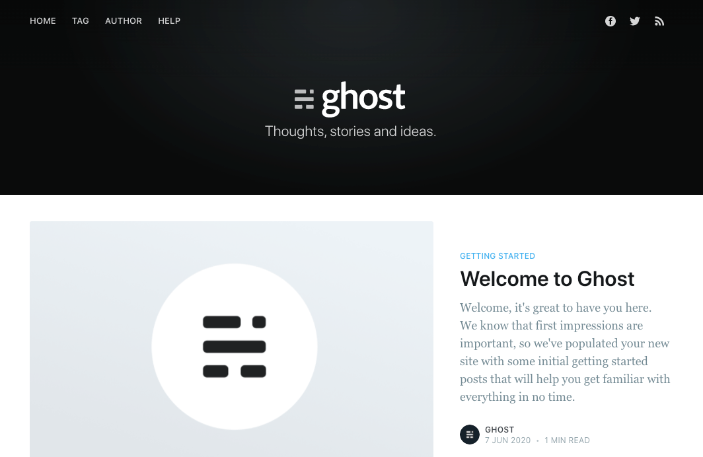

Ghost is great! It is easy to use and set up. Ghost has been our choice for our [blog](https://statusbrew.com/insights) at [Statusbrew](https://statusbrew.com/). I used Ghost as a platform for this blog too.

Ghost, however, does require a little bit of programming knowledge to get started. Although it is easier to set up a local ghost blog to start theming, a consistent dev environment becomes necessary as more devs work on the same theme.

Docker is an amazing tool to sync dev environments. After learning about it, we at Statusbrew decided to start moving our various applications/services to Docker.

As I started to work on the theme of this blog, I realized it would be good to create a Docker environment for Ghost theme development.

> Boilerplate repository is available at [https://github.com/amritsarstartups/ghost-theme-docker](https://github.com/amritsarstartups/ghost-theme-docker)

## Dockerfile

```
# Choose the ghost version
FROM ghost
LABEL maintainer="rishabhmhjn"

# Set the working directory.
WORKDIR /var/lib/ghost

RUN ghost config url http://localhost:3102

EXPOSE 2368
```

## docker-compose.yml

```

version: '3.7'

services:
  ghost-theme-docker:
    image: ghost-theme-docker:1.0
    container_name: ghost-theme-docker
    restart: unless-stopped
    build:
      context: .
      dockerfile: Dockerfile
    volumes:
      - './.tmp/data:/var/lib/ghost/content/data'
      - './.tmp/images:/var/lib/ghost/content/images'
      - './.tmp/settings:/var/lib/ghost/content/settings'
      - './Pico:/var/lib/ghost/content/themes/Pico'
    ports:
      - "3102:2368"
    environment:
      - NODE_ENV=development   # ← This is the key to success
```

The volumes have been added to share data between your Docker image and the host. In this example, we are using the theme [Pico](https://github.com/TryGhost/Pico.git).

After you have your Docker files in place, you can build and run the image using the following:

```
docker-compose -f "docker-compose.yml" up -d --build
```

Once the build is complete, you can access your new blog at [http://localhost:3102/](http://localhost:3102/)



Then you can go to [http://localhost:3102/ghost](http://localhost:3102/ghost) to set up your new admin account. On the Ghost dashboard, click on Design in the left sidebar and activate your new theme.


You can make changes to your new theme and refresh the page to see it reflected in the website.

The key to success was defining the node environment.

```
    environment:
      - NODE_ENV=development   # ← This is the key to success
```

Happy Ghost theming!
