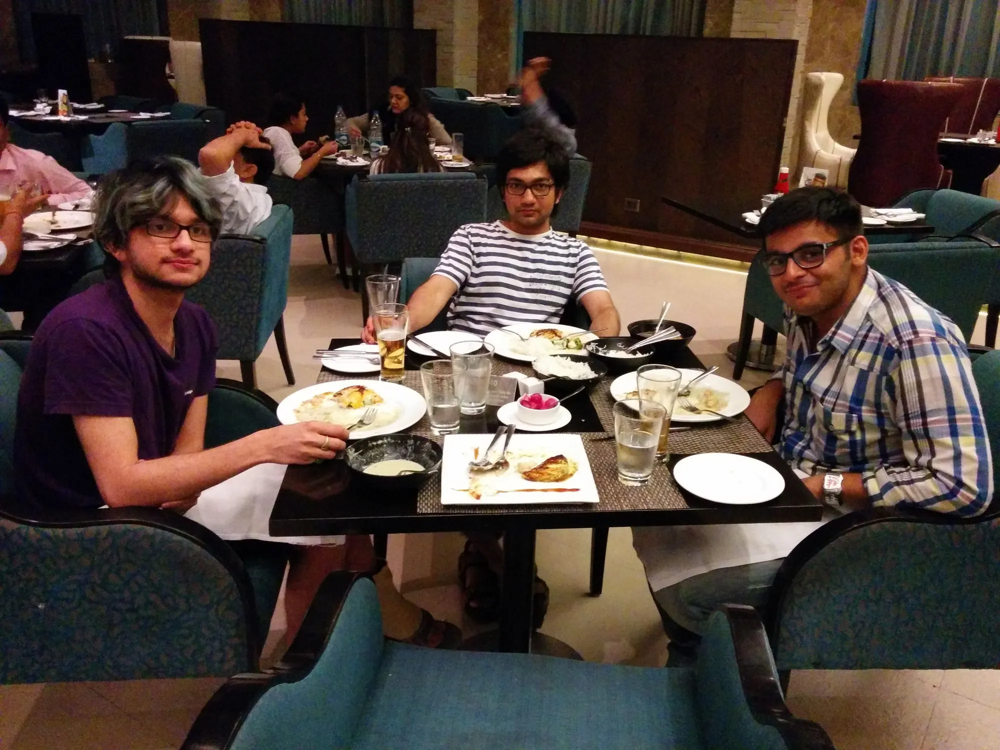

These are unprecedented times. There was arguably never a such instance where humanity had to collectively experience a challenge so lethal and ubiquitous in the documented history of our existence.

> People have been forced to stay indoors.
>
> Businesses temporarily shut down.
>
> Mass lay-offs, migration of labor.

Whenever people from any part of the world come together again, they would have that one collective experience to talk about. Where were you during this? How was it there? I am sorry for your loss.

While human loss is something (and an emphatic something) to reckon with, the invisible economic decline has not eluded the minds of many concerned. Forced shutdowns & Stay At Home orders mean that any business which is not deemed as an Essential Service is required to keep shut. Shelter In Place orders take it further, and Elon is pissed!

While some industries that relied on being physically available have taken the plunge (Hyperlocal Market Places, Retail, Travel & Tourism, Sports, etc.), some notable businesses have witnessed a growth curve during this period of crisis. It is not surprising to see that majority of those businesses are from Tech, specifically internet businesses.

I would like to focus on a specific category of internet businesses – SAAS.

## What is SAAS?

SAAS, or Software as a Service, primarily refers to the software delivery model where software is hosted on a server and can be accessed online, usually via a subscription. Contrast it with the traditional model of software delivery where software had to be purchased (via CD or similar) and had to be installed on an individual machine; SAAS is usually accessed via a web-browser, a mobile app, or an API.

## The Microsoft Office example

An easy to understand example would be Microsoft Office.

Earlier it was shipped on CDs or DVDs with a one time purchase and could be licensed to only one computer. This kind of software was also known as On-Premise Software. A new version of software always had to be purchased again.

Office 365, however, has a SAAS model where it is made to be available on a subscription model. Updates are provided regularly and at no extra cost.

You can find more about the differences b/w SAAS and On-Premise Software at <https://www.sales-i.com/saas-vs-on-premises-which-is-right-for-you>.

Other notable examples in SAAS are G-Suite, Zoom, Atlassian, Zoho & [Statusbrew](https://statusbrew.com/) (I am one of the co-founders).

## SAAS from an entrepreneur’s perspective

SAAS has revolutionized the software industry for good. Someone with a good domain/industry knowledge can rent a server online (via SAAS, or specifically PAAS (Platform as a Service) like AWS and Azure) can deploy their piece of software and can deliver it to anyone around the world over the internet. It doesn’t require any hefty infrastructure investment, logistics, or a large number of outside sales reps. Troubleshooting (after-sales) can be done online. The software can get smarter and can add features in shorter cycles.

This also means that the software can be provided cheaply and at scale. More users can purchase it. The sales cycles are shortened as the majority of communication & transactions happen online.

The beauty of SAAS is that if you have a good understanding of a customer problem or an inefficiency in the industry, you can solve that using SAAS. The key is having the right domain knowledge & expertise.

## SAAS from the buyers’ perspective

There is no hefty infrastructure spending on the buyers’ side as well. A business owner can now focus more on their customers rather than managing internal developers or thinking about maintenance or infrastructure. So, where in the early days, software was usually owned by large companies that could afford to buy and maintain the software, now small businesses can own software at a significantly lower cost.

For once, SAAS has been able to align the goals of the service provider and the customer, as customers can now pay for the portion of software that is used. They can increase or decrease the plan pricing at virtually any time of the subscription.

Due to this, SAAS is sometimes also called On-Demand Software.

## Advantages to SAAS businesses in India

Due to the nature of SAAS businesses, India has a few advantages compared to other countries.

### Change in buyer behavior

In the early days, buyers usually would meet the software seller or reseller and then make a decision to purchase (this still is a significant way of business dealing in Japan.) Now, the software can now be created from anywhere and the prospect can evaluate it online, and decide to purchase. Therefore, software providers in India have a level playing field to produce good quality software and sell it to anyone in the world.

### Availability of domain expertise

No matter what the product is, there is still some amount of Human Assistance required. Customer Support, After Sales, etc. India gets a huge advantage as there is a significant number of trained and qualified talent in India who have provided services in their respective industries for a considerable period.

### Efficient use of capital

The limited amount of cash with the early-stage startups can produce more results in India due to the cost of living advantages. Since in the early days, the majority of expenses are in human resources specifically in engineering, a lot more can be done with the cash in hand available to startups in India than what could be done in places like Silicon Valley. The cloud infrastructure has also made it possible to create the software from tier 2 cities like Amritsar without having to spend on expensive server costs.

### Raw unsolved consumer problems

As more consumers and businesses go online in India, many with their first exposure to software, there is a growing need to support the demands of scale using automation and customer management. With the contextual understanding of both the local businesses and their customers, it is easier to build software to support their specific requirements.

### Limitations of SAAS during COVID-19

It is important to note that not all SAAS businesses may have seen a growth curve during the COVID-19 time due to the limitations imposed on the industries they support.

A quick example will be Petpooja, a SAAS startup that provides POS software to restaurants. As restaurants temporarily shut down, service providers to this industry, like Petpooja, might find it hard to acquire new customers or even retain the old ones.

## Statusbrew – Social Media Management SAAS from Amritsar

### 2011 to 2013 – Twitter, Drupal & Linode

Tushar made the first version on Statusbrew (previously called Unfollowers) back in 2011. After he graduated, he came back to Amritsar and started working on the MVP. Twitter was the only social network supported back then. The analytics app was made on top of Drupal CMS and was served from our Linode VPS in Newark, NJ.

All that was needed to reach this level was discipline, a good internet connection, a MacBook Pro, and an understanding of the changing social media consumer behavior.

He didn’t spend too much on the infrastructure and scaled the servers as the customer base grew. At the end of 2013, he successfully integrated Stripe as the payment gateway, which helped in monetization from our early customers.

### 2014 to 2019 – Reaching USD 85k MRR

With nearly three years in Social Media Management and the relevant domain expertise, Tushar had grown the company to the north of USD 40k MRR (monthly recurring revenue) before I joined him in Apr 2015.

With our combined knowledge of infra scaling, consumer patterns from Japan, US, and the rest of the world, agility in supporting other networks such as Instagram, LinkedIn and our team, which initially comprised of our childhood friends Sankalp and Supreet (who are still with us to this date), we saw a tremendous growth in user adoption and revenues.

Our revenues peaked at USD 85k of MRR. We had built a global platform with a highly talented team, high-quality support serving nearly 8000 customers, and having team members from 7 different countries, all working from Amritsar.

### 2019 and beyond COVID-19

In 2019, we made a big decision to change our business model from B2C to B2B and build a next-generation social media suite with tools like Publishing, Customer Support, and Analytics.

We also started to build an inside sales team with arguably the most lucrative compensation packages of up to 2x in bonuses on reaching sales targets.

Although COVID-19 did lead to some customer churn, we continue to grow at a net rate of over 10% MOM. Our product and marketing team have worked hard to keep our application and communication stable.

We are also looking at adding more talent to our development, marketing, and sales teams who would currently be working remotely and may be required to work from our [HQ](https://facebook.com/statusbrewhq) once the lockdown is over.

I thank you for reading this long text, and I hope I was able to convince you about the possibility of creating a global company from wherever you are. Please reach out to me on LinkedIn or Twitter if you have any questions.

We have been building communities of creators, go-getters & entrepreneurs from Amritsar and regions around. Join us at [Amritsar Founders](https://facebook.com/amritsarfounders) (an exclusive group for entrepreneurs), [Amritsar Startups](https://www.facebook.com/groups/amritsarstartups/) (an inclusive group of developers, entrepreneurs, business owners or enterprises).
